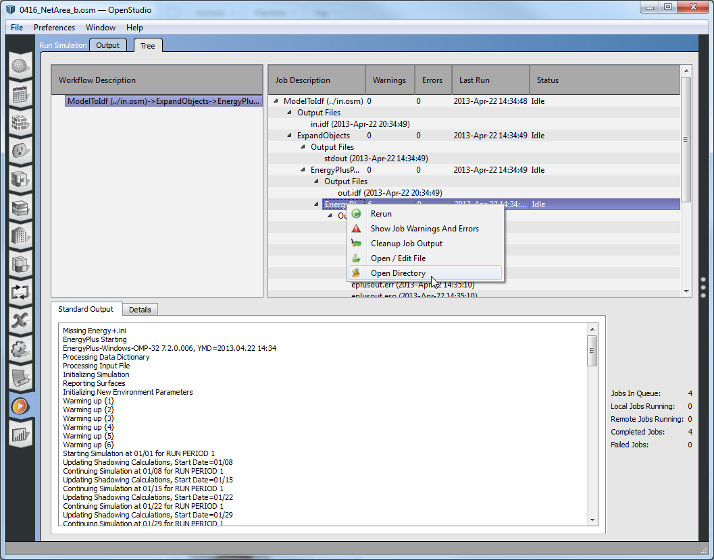

# Troubleshooting
## Model Won’t Open in SketchUp Plug-in
If you have an OSM file that wont' open or opens incorrectly in the SketchUp plugin then running the user script linked in this thread can help identify the problem objects and create a new diagnostic copy of your file. This script creates a report identifying problem objects, and save a new copy of your file, leaving the original un-touched. This script is installed with 0.6.2 or later, but you can manually download this file and use it with 0.6.0 or later. Some reasons you may need to run this script.

* You are trying to open an OSM file created from an outdated beta version of OpenStudio
* Through some form of editing conflicting objects exist in the model that prevent it from opening correctly.
* Hand editing of the file results in invalid objects or objects missing necessary data
* It is possible some file corruption can occur through other methods.

Whatever the cause, this should help identify and fix the problems. As it may delete some objects (in the diagnostic copy) you may have to do some repair or cleanup work on the resulting file.

To install user scripts. drop them in the following subdirectory of your OpenStudio installation and re-start SketchUp. Currently you can't nest them deeper than the user_scripts folder. They must be loose files in that directory for the OpenStudio SketchUp Plug-in to add them to the me

__OpenStudio 1.5.0\Ruby\openstudio\sketchup_plugin\user_scripts__

Then to run the script go to the "User Scripts" menu under the SketchUP Plugins menu "Plugins / OpenStudio" menu and choose "OSM Diagnostic Script".

Right click on the link below and save to your computer vs. opening in web browser:
[OSM_Diagonstic_Script.rb](../../img/scripts/OSM_Diagnostic_Script.rb)

## Model Won’t Run
Some of the reasons simulation errors occur are:

* EnergyPlus is not installed. You must have EnergyPlus installed to run a simulation.
* The version of EnergyPlus you are using is not compatible with the version of OpenStudio you are using. Check under the menu Preferences/Scan for tools to see what version of EnergyPlus you are using.
* If the weather file has not been set, the simulation will fail. 
* Design days or sizing are required if you are simulating a full HVAC system, instead of using idea air loads. 

If you are in the OpenStudio application the image below shows you how to get access to the"eplusout.err" file that lists the EnergyPlus errors. You can view it with a text editor.

If you are in PAT you should be able to expand the view in the run tab to see errors and warnings at any stage. It failed so quickly maybe it is an issue with weather file or DDY file? See the image below.

<!--## OpenStudio Crashes--> 

<!--#Resutls Look Wrong## Under Heated and Cooled Hours--> 

## Energy Modeling Forum
Post your questions to the forum below for energy modeling information.
[__Unmet Hours__](https://unmethours.com/questions/scope:all/sort:activity-desc/tags:openstudio/)

## Useful SketchUp Links

* [SketchUp's On-Line Help Guides and Video Tutorials]()
* [Google's user forum for SketchUp](https://productforums.google.com/forum/?hl=en#!categories/sketchup/sketchup)
* [SketchUcation's SketchUp forum](http://sketchucation.com/forums/)

_______________________

<small>OpenStudio is developed in collaboration by NREL, ANL, LBNL, ORNL, and PNNL.</small>
 

<small>NREL is a National Laboratory of the U.S. Department of Energy, Office of Energy Efficiency and Renewable Energy, operated by the Alliance for Sustainable Energy, LLC.</small>

<small> <a href="http://openstudiodev.prod.acquia-sites.com/">Return to OpenStudio Home</a>

 
  
  

