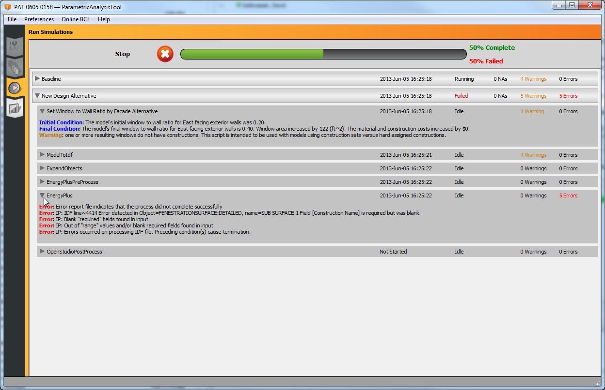

# Troubleshooting

## Model Won't Open in SketchUp Plug-in

If you have an OSM file that will not open or opens incorrectly in the SketchUp plugin then running the user script linked in this thread can help identify the problem objects and create a new diagnostic copy of your file. This script creates a report identifying problem objects, and save a new copy of your file, leaving the original un-touched. This script is installed with 0.6.2 or later, but you can manually download this file and use it with 0.6.0 or later. Some reasons you may need to run this script.

_________________

## Model Will Not Open in SketchUp Plug-in
If you have an OSM file that will not open, or opens incorrectly in the SketchUp Plug-in then running the user script linked in this thread can help identify the problem objects and create a new diagnostic copy of your file. This script creates a report identifying problem objects, and saves a new copy of your file leaving the original un-touched. This script is installed with 0.6.2 or later, but you can manually download this file and use it with 0.6.0 or later. Some reasons you may need to run this script include:

* Trying to open an OSM file created from an outdated beta version of OpenStudio
* Through some form of editing, conflicting objects exist in the model that prevent it from opening correctly
* Hand-editing of the file results in invalid objects or objects missing necessary data
* Other forms of file corruption

Whatever the cause, this should help identify and fix the problems. You may have to do some repair or cleanup work on the resulting file, as some objects may be deleted.

To install user scripts, drop them in the following subdirectory of your OpenStudio installation and re-start SketchUp. Currently you can't nest them deeper than the user_scripts folder. They must be loose files in that directory for the OpenStudio SketchUp Plug-in to add them to the me

To install user scripts, drop them in the following subdirectory of your OpenStudio installation and re-start SketchUp. You cannot currently nest them deeper than the user_scripts folder. They must be loose files in that directory for the OpenStudio SketchUp Plug-in to add them to the menu.

__OpenStudio 1.5.0\Ruby\openstudio\sketchup_plugin\user_scripts__

To run the script, go to the "User Scripts" menu under the SketchUp Plugins menu, "Plugins / OpenStudio" menu and choose "OSM Diagnostic Script".

Right click on the link below and save to your computer vs. opening in web browser:
[OSM_Diagonstic_Script.rb](../../img/scripts/OSM_Diagnostic_Script.rb)

_________________

## Model Will Not Run
Some of the reasons simulation errors occur are:

* EnergyPlus is not installed. You must have EnergyPlus installed to run a simulation.
* The version of EnergyPlus you are using is not compatible with the version of OpenStudio you are using. Check under the menu Preferences/Scan for tools to see what version of EnergyPlus you are using.
* If the weather file has not been set, the simulation will fail. 
* Design days or sizing are required if you are simulating a full HVAC system instead of using idea air loads. 

If you are in the OpenStudio application, the image below shows you how to get access to the "eplusout.err" file that lists the EnergyPlus errors. You can view it with a text editor.

If you are in PAT, you should be able to expand the view in the run tab to see errors and warnings at any stage. If errors do not show up in the run tab, there may be an issue with the weather or DDY files. See the image below.

_________________

## Unable to Communicate with Amazon Cloud from Command Prompt Using the "bundle" Command

This issue is typically a communication error between you and RubyGems.org. Few things to check:

1. Are you behind a proxy? If so, then check if the proxy is system wide or just your web browsers. Typically easiest to open up your favorite browser and look in the settings.
2. Is there any web site restrictions at your location? If so, then it is possible that your IT department is blocking access. Note that RubyGems is only the first hurdle, you will also need access to AWS (meaning Amazon).

If you think that the above is happening. Then it is best to talk to your IT department and explain the situation. The general explanation for the "situation" is that you are trying to run a large number of simulations using Amazon Web Services. Some good questions may be:

1. How can I access the internet through a command line (or terminal) using our companies proxy?
2. When I ping aws.amazon.com, it times out, is there something that may be restricting access to the site?
3. Can we set the proxy to be machine wide, instead of just on the web browsers?

_________________

<!--## OpenStudio Crashes--> 

<!--#Results Look Wrong## Under Heated and Cooled Hours--> 

## Energy Modeling Forum
Post your questions to the forum below for energy modeling information.
[__Unmet Hours__](https://unmethours.com/questions/scope:all/sort:activity-desc/tags:openstudio/)

_________________

## Useful SketchUp Links
* [SketchUp's On-Line Help](http://help.sketchup.com/en)
* [Forum for SketchUp](https://productforums.google.com/forum/?hl=en#!categories/sketchup/sketchup)
* [Google's user forum for SketchUp](https://productforums.google.com/forum/?hl=en#!categories/sketchup/sketchup)
* [SketchUcation's SketchUp forum](http://sketchucation.com/forums/)

 
  
  

