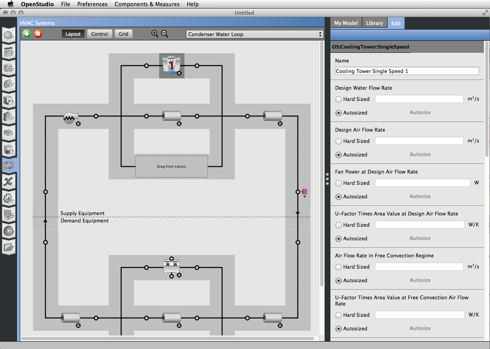
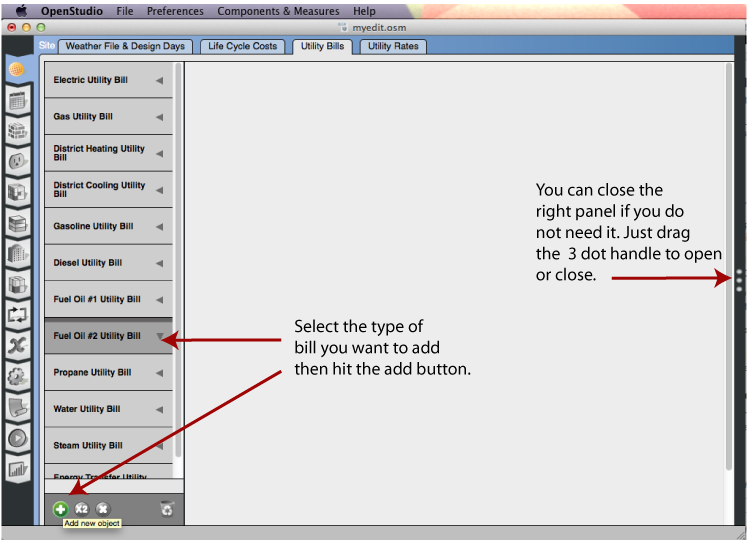
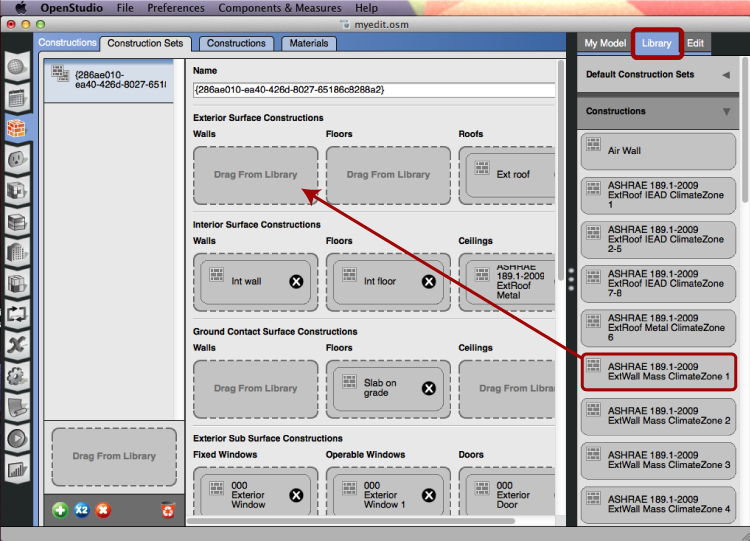
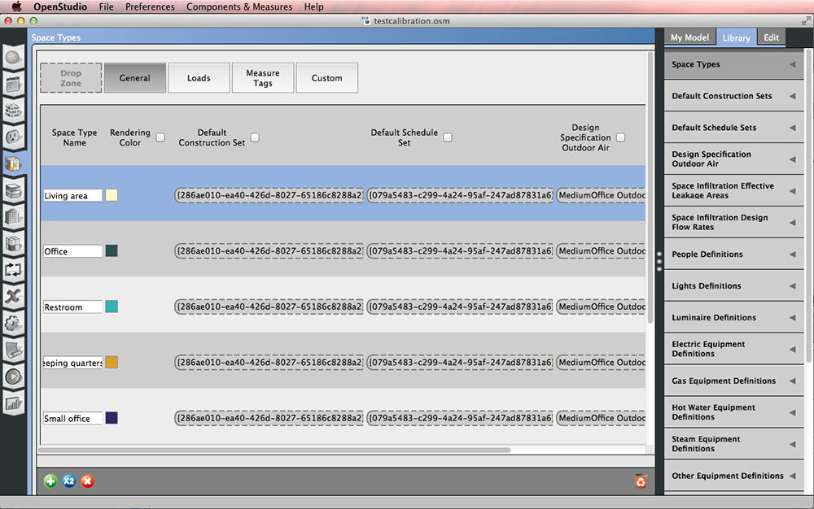
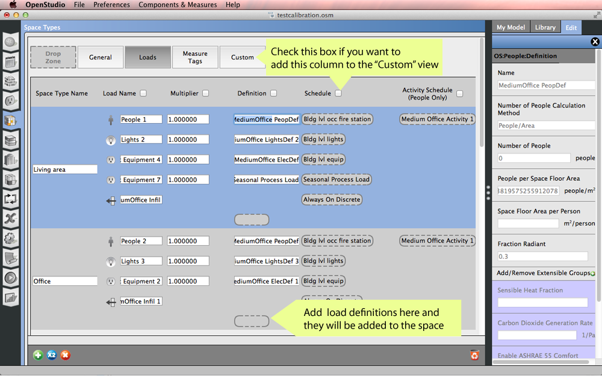
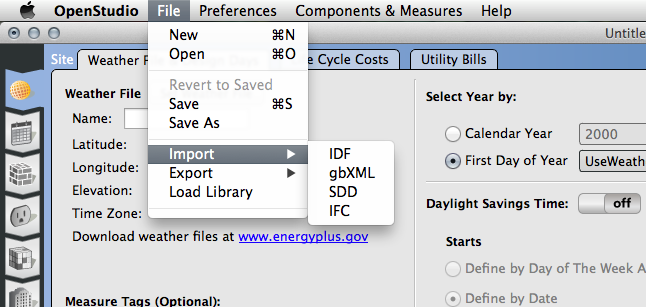
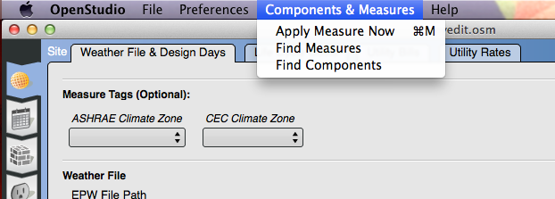

# OpenStudio Application Interface
This section contains an overview of the OpenStudio Application interface.

The [OpenStudio Quick Start Guide](../../img/pdfs/openstudio_interface_quickstart_1.4.0.pdf)  also provides an introduction to the interface for the Plug-in and the OpenStudio application. It also provides guidance on the basic workflow. 

------ 

## Overview

The tabs on the left that move vertically are ordered in a suggested workflow.

*Above: Overview of the OpenStudio Application Interface.*

------

## Sub-tabs

Sub-tabs are designed to move from more general on the left to more specific on the right. On the constructions tab the sub-tabs are "Construction Sets", "Constructions", and "Materials." If you are not building your own materials and constructions you may not need to go to the "Materials" sub-tab.

------ 

## Right Panel

The __right panel__ provides access to items in the library, your model, and the ability to edit some of the items.

* “My Model” displays items that are part of your model already.

* “Library” includes components and measures that come with the application or are downloaded from the Building Component Library (BCL)

* “Edit" allows you to select certain components and edit the settings for that component. It is used in the HVAC tab to edit component settings, assign thermal zones to loops, and to add plenums.

*Above: Edit settings on some objects in the edit panel.*

------  

## Left Panel Bottom

 Add New Item allows the user to add a new component to the interface. Sometimes the type of item added depends on the selection in the left panel.

*Above: On the "Utility Bill" sub tab select the type of bill you want to add before hitting the add button.*

 Duplicate a selected object with this button.

 Delete a selected object with this button.

 Purge unused objects with this button.

------ 
 
## Adding Objects from the Library
To add items from the library, select the "Library" tab on the right panel and find the item you want to add to the model. Select that item and drag and drop in into the correct drop zone. Drop zones are surrounded by a dotted line and are programmed to only accept items that will work for that field.

*Above: Drag-and-drop items from the library to the drop zones in the model.*

*Above: Drag-and-drop example on the HVAC service hot water.*

------
 
## Grid View: Thermal Zones, Space Types, and Refrigeration
Earlier releases have included a grid view for the refrigeration section in the HVAC tab. Now you can edit thermal zones and space types in a grid view. This makes it easier to view all your zones and space types at once and compare settings. By selecting the buttons across the top you can select the fields you would like to see and edit.

Select the check box in the top of the column if you want to view that column in the "Custom" category. 

Drag components and schedules into the grid view. Most items on the grid can be inspected in the right panel "Edit" tab, except schedules. To edit or view schedules go to the schedules tab. Use the delect in the "Edit" panel to remove a component from the grid.

Click on the color box on the "General" button to change the rendering color of the space type. This will change the rendering color in the SketchUp Plug-in as well.

*Above: The grid view provides a spreadsheet style layout.*

*Above: Hit the "Loads" button to edit and view loads by space type. Click on the name of a component and select the  "Edit" panel on the right to inspect and edit that item. You can edit the load definition in the example shown above.*

*Above: The grid view of thermal zones.*

------ 

## File Menu

If you launch the OpenStudio application from the SketchUp Plug-in, your open file will automatically open in the application. But to save the file or open a new file, select file open from the menu.

When you save an OSM model in the OpenStudio Application or the SketchUp Plug-in a folder is saved next to the OSM file. This folder contains external resources such as the weather file, scripts, and simulation results.

Load Library is also a very important feature. This allows you to load building component libraries for specific building types. These libraries are the same as those used in the SketchUp Plug-in templates.

*Above: The file menu contains the open, save, revert, export, and import functions.*

------ 

## Preferences Menu

The Units menu lets you switch between SI and IP units. This affects both input fields and output data on the results tab. It does not currently affect standard EnergyPlus output files.

The SketchUp Plug-in has access to this as well under “Plugins/OpenStudio/Preferences”.

Scan for Tools will look for Radiance, Ruby, and EnergyPlus installations. If you install those 
applications Prior to installing OpenStudio this shouldn’t be necessary.

*Above: The file menu contains the open, save, revert, export, and import functions.*

------ 

## Components & Measures Menu

*Above: This menu item allows you to run one measure on you model.*

### Apply Measures Now
You can apply measures to your model at any time by going to the “Components and Measures” menu and selecting the “Apply Measures Now” option.

This will open a dialog that allows you to choose a measure from the library to apply, go to BCL to find a measure to apply, or even write your own measure and test it.
 
Once you select a measure you may edit the measure inputs on the right side of the dialog. Hit apply measure to start.

*Above: This menu item allows you to run one measure on you model.*

### Find Measures and Find Components

The BCL window gives you access to an online repository of building energy modeling data called the Building Component Library. Although you can access the BCL website on its own, OpenStudio has integrated access to the BCL from within the application. You can access this through the “Window” menu.

The first time you /open this window you will be prompted for an API key, unless you have already used BCL functionality in the SketchUp Plug-in. [Instructions for finding your API Key](../getting_started/GettingStarted.md#connecting-with-the-building-component-library) are in the "Getting Started" section.

*Above: This window gives you access to the online BCL to download measures or components.*

