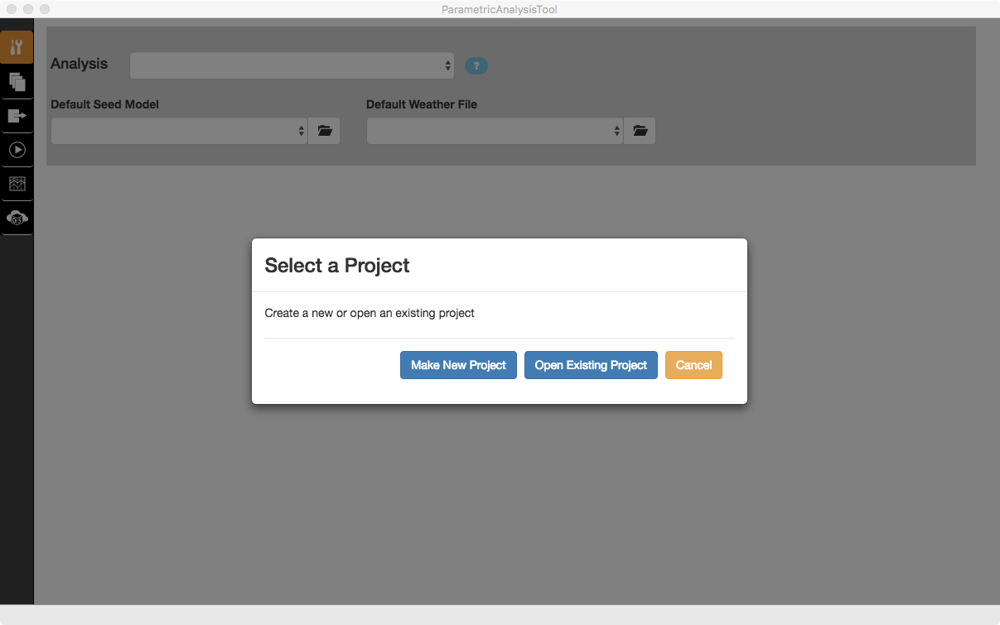
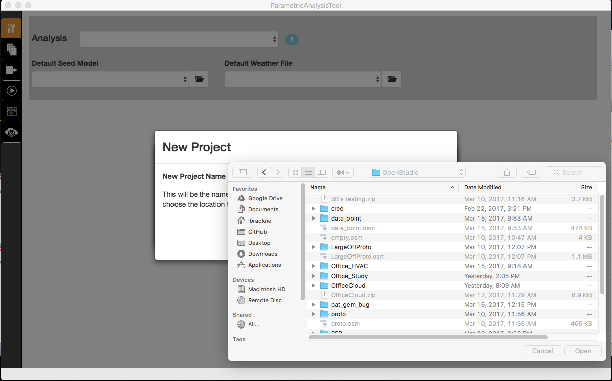
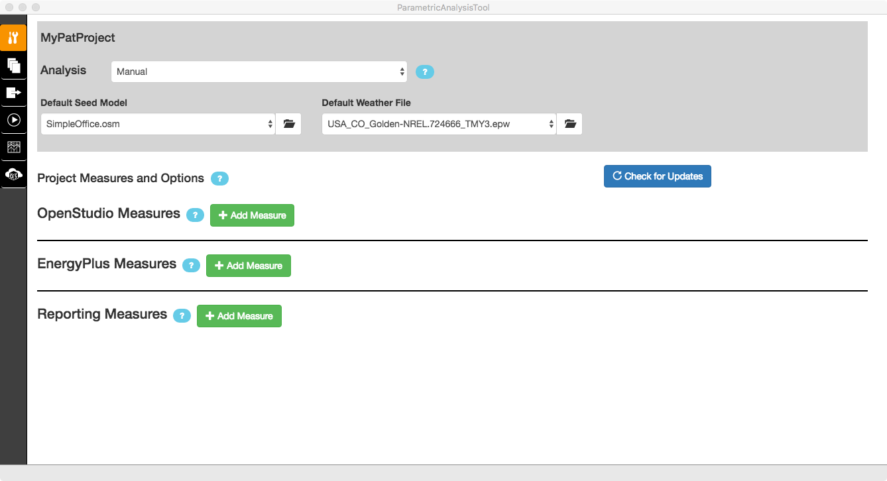
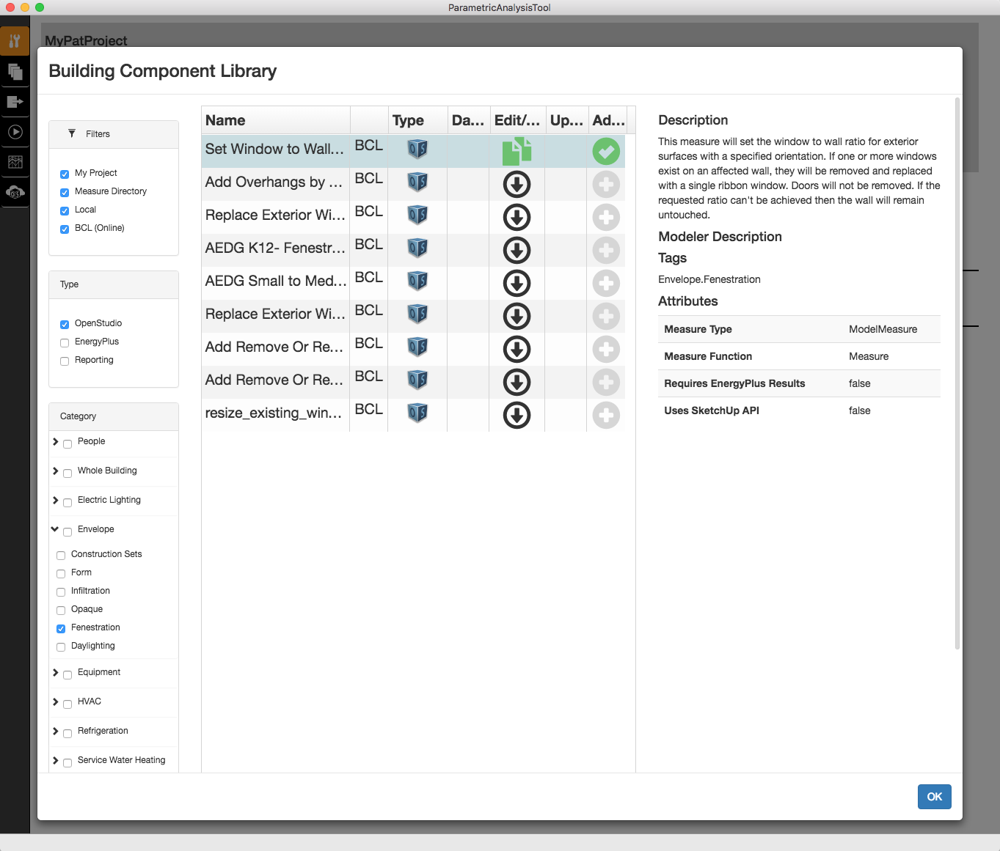
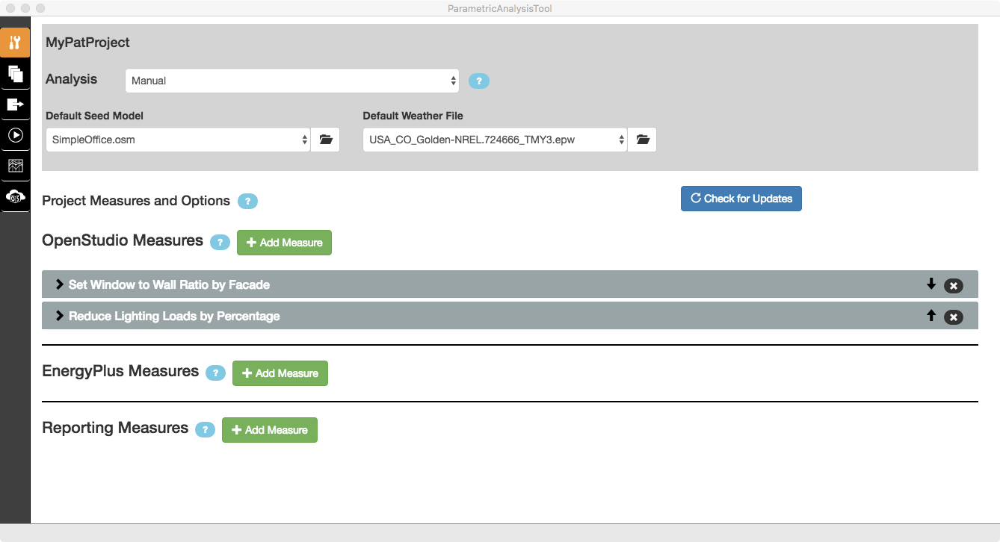
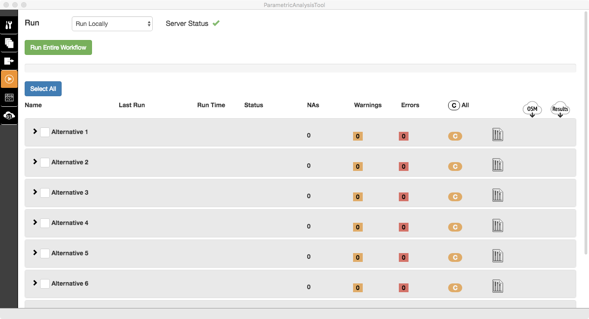
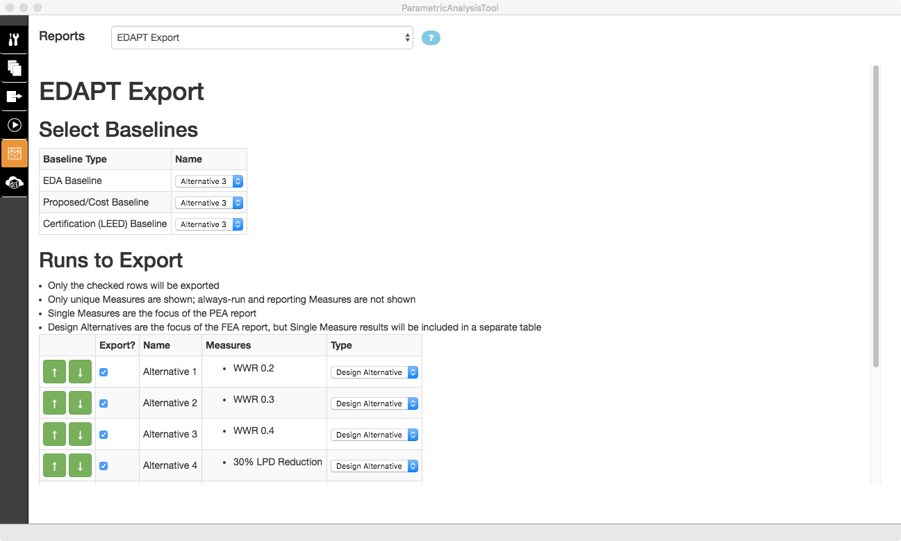

<h1>Parametric Analysis Tool 2.0 (PAT) Interface Guide</h1>
PAT allows you to quickly try out and compare different design options, energy efficiency measures, and mechanical systems by applying OpenStudio Measures to your seed model.

___________________

## Create a Project

When you launch PAT you have the option to create a new project or open an existing project.

*Above: At launch you can create a new project or open an existing one.*
  

To create a new project :

1. Click the "Make New Project" button
2. Type the name for the project, and click "Continue"
3. Browse to the directory where you want the project saved, and click the "Open" button.

[comment]: # (remove restriction on spaces in path and project name once that is fixed. Item #59 on 2.0 google doc.)

Note: The PAT 2.0 release currently requires that both the file name and path for the project don't have any spaces.

*Above: The Make New Project dialog.*
  
___________________

## Open an Existing Project

You can open an existing PAT project when you first launch PAT or from the file menu. In either case a dialog will open to find the path where you created your Project. There is no file to select, just browse to the top level project directory.

  
*Above: Open Existing Project.*
  
___________________

## Interface Overview

The function of the six tabs in the PAT 2.0 interface are to:

1. Select measures, measure options, seed models, and weather files.
2. Create design alternatives
3. Request outputs *(future feature)*
4. Run the analysis
5. View reports
6. View the server

You can move through the six vertical tabs on the left navigation by working in order from top to bottom. The video below shows the creation of a new project and walks through the workflow to create an run an analysis. 

<iframe width="640" height="360" src="http://www.youtube.com/embed/a3lg7UbE6JU" allowfullscreen></iframe>

*Above: PAT 2.0 introduction video*
  

[comment]: # (update documents and remove this once algorithmic workflow is added)

Note: Analysis Type is currently limited to manual. Algorithmic analysis will be enabled in a future version.
___________________

## Load a Seed Model and Weather File
Select your seed model by clicking the folder symbol for the "Default Seed Model". Select your weather file by clicking the folder symbol for the "Default Weather File."

*Above: View of measures tab after browsing for both a seed model and a default weather file.*
  

[comment]: # (haven't mentioned multiple seed files and epws here or on the design alternatives tab. Not sure if I should address at all now. Changing epws doesn't work, and I haven' tested multiple seed files.)

Note: The PAT 2.0 interface allows for different seed models and weather files for different design alternatives, but this functionality  isn't complete and will likely produced unexpected results. This will be addressed in a future version.
___________________

## Add Measures and Create Measure Options

If you want to learn more about measures, check out the [About Measures](../getting_started/about_measures.md) section.
 Check out the [Measure Writing Guide](../reference/measure_writing_guide.md) to start writing your own custom measures.

There are three types of measures:

1. __OpenStudio measures__ are run on the OSM model before it is converted to an IDF.
2. __EnergyPlus measures__ can be run on the IDF file before it is simulated in EnergyPlus.
3. __Reporting measures__ produce reports to chart results, provide quality assurance, and quality control on models.

The measures are applied to the model in order from top to bottom.

Click the "Add Measure" buttons by the OpenStudio, EnergyPlus, or Reporting measure text, to add measures of that type to your project. The "Building Component Library" dialog that opens after clicking the buttons allows you to add both local measures and BCL (Online) measures.

### Download Measures From the Building Component Library (BCL)

The Building Component Library dialog allows you to filter by measure location, measure type, measure category, and  measures sub-category. When it first opens it will have all locations checked except for BCL (Online). It will also have only one measure type checked, based on which button you clicked in the measures tab. Nothing is checked by default in the "Category" section which has the effect of all categories showing. Once you check one or more categories or sub-categories only those will be shown. That filter will remain in place when you come back to this dialog in the future. So if you don't see the measure you expect, make sure the category filters are setup correctly.

The measure locations are:

1. __My Project__ - shows are measures that have already been added to your currently open project.
2. __Measure Directory__ - shows measures you have authored in a user configurable "MyMeasures" directory on your computer.
3. __Local__ - are local instances of the Online BCL measures that have already been downloaded to your computer.
4. __BCL (Online)__  - will show all public measures on the Building Component Library (Online). To use add these to a project they must first be downloaded. 

*Above: Default view of BCL dialog when it first opens.*
  

To download measures:

1. __Check the "BCL (Online)" box__ under the Filter options.
2. __Filter Category and Subcategory__ to narrow down the list of measures. You can select a measure to see its description.
3. __Click the black arrow__ in the "Edit/Copy" column of the grid.

Once the symbol changes to the green document symbol the measure has been downloaded. 

- It will typically move to the top of the list, but you can click column headers to sort by other attributes. 
- If there are online updates to a local BCL measure the "Update" column will have a an symbol you can click to update your local copy of the measure.
- Clicking the green document symbol will create a copy of the measure in your "MyMeasures" directory.

[comment]: # (remove this comment once the corrupted meaasure.xml issue is fixed. Item #64 on 2.0 google doc.)

Note: There is an issue in the current 2.0 release that causes issues if you both download and add a measure to your project while in the same dialog session. To avoid this first download the measures from BCL, close the dialog, then re-open the dialog to add the measures to your project. This is only an issue the first time you use a measure from BCL.

### Add Measures to the Project

Clicking the blue plus will add the measure to your project. 

*Above: Filtered View showing Online BCL OpenStudio Fenestration measures. Set Window to Wall Ratio measure has been downloaded from Online BCL but not yet added to the project.*
  

After adding a measure to your project blue plus will change to a green check mark. 

*Above: View of Set Window to Wall Ratio measure after being added to project.*
  

After closing the Building Component Library dialog, measures are now loaded in the project. 

- Individual measures can be moved up or down using the arrows at the right. 
- The "x" at the right will delete a measure from the project. 
- The arrow at the left of each measures will let you expand and collapse the view into that measure.

*Above: View of measures tab after adding measure to project.*
  

### Create Measure Options and Define Variables

Every measure in the project needs at least one measure option. You can create a measure option for a measure by:

1. Clicking the __"Add Measure Option"__ button. This will add a column to the right side of the grid for the measure.
2. Change default arguments and __add in missing argument values__ for the first measure option.
3. If you want create more than one measure option then
    1. __Click the "Variable" box__ for the measure arguments you want to change across measure options.
    2. __Add additional measure options__ with unique variable combinations. 
4. __Rename measure option names__ to meaningful names for better reporting and diagnostics.

[comment]: # (remove this comment once change argument value issue is fixed. Item #63 on 2.0 google doc.)

Note: In PAT 2.0 you can't change measure arguments without checking the variable box. If you want to change a value but don't intend for it to vary across measure options then check it to change the value, then un-check it.

*Above: View of measures tab after adding measure to project.*
  

### Add the OpenStudio Results Reporting Measure to the Project

[comment]: # (remove this section if we start adding this measure to new projects automatically)

Always add the OpenStudio Results measure to the project and to each design alternative. This is necessary to properly generate the Analysis  Reports.

*Above: View of measures tab with all measures collapsed.*
  
___________________

## Create Design Alternatives

The second tab is used to create design alternatives. In the grid each row represents a design alternative and each column (to the right of "Description") represents a measure. The cell values in the measure columns represent the measure option selected for a specific design alternative and measure. If the measure option value is set to "None" for a cell then that measure will be skipped in the workflow for that design alternative.

There are three ways to add design alternatives:

1. __Add Alternative__ creates a single design alternative with all the measure options set to "None".
2. __Create One Design Alternative with Each Measure Option__ will create a design alternative for each measure option that exists with all other measure option values set to "None"
3. __Duplicate Alternative__ duplicates an existing design alternative, as a starting point for a new design alternative.

Measure option values can be edited after the measure has been created by clicking on a cell and using the pull down menu to select a different measure option or "None". 

- You can delete a design alternative by clicking the "x" at the left of each row. 
- You can also sort the rows by clicking on the column header or move individual rows by clicking the arrows near the left of the row. 

[comment]: # (remove item about row order not mattering if that is fixed in future release. Ideally order will be consist across design alternatives, run, and results tabs; at least for manual analyses. Not applicable for algorithmic.)

Note: Currently the row order doesn't affect the order that the simulations are run in, or the order the results presented.

*Above: Populated design alternatives tab.*
  

___________________

## Add Outputs

[comment]: # (update this section when algorithmic analysis type is added)

This tab is reserved for future use to setup objective functions and other output requests for algorithmic analyses.

___________________

## Run the Analysis

Clicking "Run Entire Workflow" will run all of the simulations. Make sure that "Server Status" has a green check mark to the right before you attempt to run the analysis. 

- It will take a few minutes after the application launches for the server to be ready, until then there will be a red x to the right of "Server Status". 
- Generally you don't need to use the "Stop Server" or "View Server" buttons. 

[comment]: # (remove note about cloud support once that is fully supported) 

Note: There is only partial support in PAT 2.0 to run on the cloud, so most users will leave the "Run Locally" choice alone.
 

 
*Above: View of Run Tab prior to running the analysis.*
  
 
Soon after the analysis starts the progress bar will show "Analysis started" and a row will be added for each design alternative, with a column to monitor its status. For local runs all but one of the processors will be used for parallel simulations.

 
*Above: View of Run Tab while the analysis is running.*
  
 
After the simulation is completed for a design alternative you can expand it to view the log messages from the individual measures. The number of not applicable, warning, and error messages for a design alternative can be inspected without expanding the design alternative. Reporting measure and EnergyPlus HTML files can be viewed by clicking the graph symbol.
 
- There will be a short delay after the last simulation finishes before the progress bar displays "Analysis completed".
- While the simulation is running you won't be able to switch to other tabs.
 

  
*Above: View of Run Tab after simulations are complete.*
  
___________________

## View Analysis Reports

PAT 2.0 includes three different analysis reports. The analysis reports have access to high level data from all of the design alternatives. The high level data come from reporting measures, which is why it's necessary to include the OpenStudio Results reporting measure in each design alternative. 

- Below are descriptions of the reports included with PAT 2.0. 
- Additional reports will be added in future versions.

### Summary Table

This is a tabular report showing consumption, demand, and economic metrics for all of the design alternatives. Any design alternative can be set as the "baseline" model, which other design alternatives are compared against. The values shown in all but the top row are deltas from the baseline values. 

  
*Above: Summary Table Analysis Report.*
  

### End Use Comparison

This produces stacked bar charts by end use for each design alternatives, broken down by fuel.

  
*Above: End Use Comparison Analysis Report.*
  

### EDAPT Export

This report should be used by modelers using utility based Energy Design Assistance Program Tool (EDAPT) workflows. This generates an xml report to be uploaded to EDAPT websites.

  
*Above: EDAPT Export Analysis Report.*
  
___________________

## View the Server

This tab won't be necessary for most users, but can provide additional functionality and diagnostics for advanced users. It provides an interface to the server the analysis ran on.

  
*Above: Server Tab.*
  

___________________

## Menu Bar Functions

- The File menu allows you to create a new project, open an existing project, save a project, or save a copy of a project under a new name.
- You can set your "MyMeasures" directory and access server tools for diagnostics using the Window menu.
- Other menus won't be used by most users.
