<h1>Parametric Analysis Tool 2.1.0 (PAT) Interface Guide</h1>
OpenStudio's PAT allows you to quickly try out and compare manually specified combinations of measures, optimize designs, calibrate models, perform parametric sensitivity analysis, and much more.  Manually specified combinations of measures may be run locally on your computer.  Algorithmic analyses (e.g. optimization, design of experiments, etc) can be run by connecting to a separately provisioned instance of the OpenStudio server.

___________________

## Create a Project

When you launch PAT you have the option to create a new project or open an existing project.

  

To create a new project :

* Click the "Make New Project" button.
* Type the name for the project, and click "Continue."  _Note that project names should not include spaces._

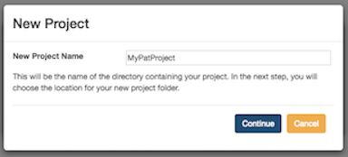

* Browse to the directory where you want the project saved, and click the "Open" button.  _PAT will create a new directory for your project at this location._

  
___________________

## Open an Existing Project

You can open an existing PAT project when you first launch PAT or from the file menu. In either case a dialog will open to find the path where you created your Project. There is no file to select, just browse to the top level project directory.

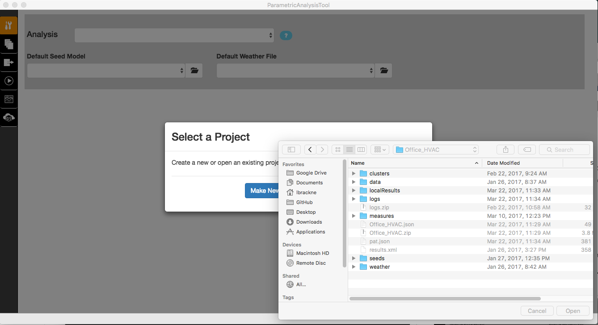
  
___________________

## Interface Overview

PAT 2.1.0 functionality is broken down into six tabs along the left side of the window:

1. Specify analysis mode (manual or algorithmic), seed models, weather files, measures, and measure options.
2. Manually create design alternatives _(Not used for algorithmic analysis)_
3. Specify outputs for algorithm-based analysis _(Not used for manual analysis)_
4. Run an analysis and manage the analysis server
5. View reports
6. View the server

In general, a PAT workflow moves through the six vertical tabs from top to bottom.  PAT allows the user to specify design alternatives manually or automate the process using a selection of algorithms - e.g. sampling, optimization, etc.  The analysis mode is selected at the top of tab one, and dictates whether tabs two or three are used along with the types of computing resources (local or cloud) that can be selected on tab four.  The video below shows the creation of a new project and walks through the workflow to create and run a **manual** analysis.

<iframe width="640" height="360" src="http://www.youtube.com/embed/a3lg7UbE6JU" allowfullscreen></iframe>

*Above: PAT 2.0.0 introduction video for manual analysis mode*
  
___________________

## Load a Seed Model and Weather File
Select your seed model, the model that will serve as the basis for creating design alternatives, by clicking the folder symbol for the "Default Seed Model". Select your weather file by clicking the folder symbol for the "Default Weather File."

  

Note: PAT 2.1.0 allows the user to specify multiple seed and weather files that may all be used within a project.
___________________

## Add Measures and Create Measure Options

If you want to learn more about measures, check out the [About Measures](../getting_started/about_measures.md) section.
 Check out the [Measure Writing Guide](../reference/measure_writing_guide.md) to start writing your own custom measures.

PAT works with three classes of measures:

1. __OpenStudio measures__ operate on the OpenStudio model (.osm) before it is converted to an EnergyPlus input file (.idf).
2. __EnergyPlus measures__ operate on the .idf file just before it is simulated in EnergyPlus.
3. __Reporting measures__ run after the simulation has been performed and are used to produce postprocess results, automate quality checks, and create custom reports and chart.

Click the "Add Measure" buttons by the OpenStudio, EnergyPlus, or Reporting measure text to add measures of that type to your project. The Building Component Library (BCL) dialog that opens after clicking the buttons allows you to add measures stored on your computer or to find new measures from the online BCL.

### Download Measures From the Building Component Library (BCL)

The Building Component Library dialog allows you to filter by measure location, measure type, measure category, and  measures sub-category. When it first opens it will have all locations checked except for BCL (Online). It will also have only one measure type checked, based on which button you clicked in the measures tab. Nothing is checked by default in the "Category" section which has the effect of all categories showing. Once you check one or more categories or sub-categories only those will be shown. That filter will remain in place when you come back to this dialog in the future. So if you don't see the measure you expect, make sure the category filters are setup correctly.

PAT keeps track of four distinct measure locations:

1. __My Project__ - includes measures that have already been added to your current PAT project.
2. __Measure Directory__ - shows measures you have stored in a user configurable "MyMeasures" directory on your computer.  A best practice is to only create or modify measures in your "MyMeasures" directory.
3. __Local __ - includes any BCL measures you may have already downloaded to your computer.
4. __BCL (Online)__  - contains all publicly available measures located in the online BCL. To use add these to a project they must first be downloaded, which copies them to your local library.

_Note: In rare instances, the BCL dialog may appear empty even when local content exists or the online BCL has been added to the filter.  This can happen when OpenStudio's "measure manager" process is not halted normally.  The issue is easily resolved by quitting PAT, and using your computer's task manager to look for an "openstudio" process.  Halting this process enables the BCL dialog to work normally again._
  

To download measures:

1. __Check the "BCL (Online)" box__ under filter options to show BCL content.
2. __Check filters__ to narrow down the list of measures by type, category, and subcategory.
3. __Click the black arrow__ in the "Edit/Copy" column of the grid once you've found a measure you're interested in.

When the symbol changes from a black download arrow to the green document symbol the measure has been downloaded and added to your local library.  Clicking the green document symbol will create a copy of the measure in your "MyMeasures" directory.  This is useful when creating variations of existing measures.

Once downloaded, PAT will continue to check to see if an updated version is available in the BCL.  Available updates will be indicated with a symbol in the 
"updates" column.  Simply click the symbol to download the latest version to your local library.

### Add Measures to the Project

Clicking the blue plus will add a measure from your local library or "MyMeasures" directory to your project.  Measures with a gray plus have not yet been downloaded from the BCL, and cannot be added.

 

*Above: Filtered View showing Online BCL OpenStudio Fenestration measures. The "Set Window to Wall Ratio" measure has been downloaded from the BCL but not yet added to the project.*
  
After adding a measure to your project the blue plus will change to a green check mark. 

  
After closing the BCL dialog, measures are now loaded into the project.  In this example, two measures have been added.

**The ordering of measures in PAT matters.**  Measures run from top to bottom in the user interface, and they may be reordered using the up or down arrows at the right.  The "x," also at the right, may be used to delete a measure from the project. 

Note that each measure also has an arrow just to its left.  This arrow is used to expand and collapse the measure, allowing the user to specify variables, arguments, and more.
  

### Create Measure Options and Define Variables

Every measure in the manual analysis project needs at least one measure "option."  An option describes a measure and particular set of measure arguments that will be applied to create a specific design alternative.  For example, a generic fan efficiency measure would likely have an efficiency argument.  Applying that generic measure with a specific value for efficiency would constitute an option representing a specific fan product.

Clicking the __"Add Measure Option"__ button adds a column to the right side of the grid for the measure.  Newly created options have a generic option name, description, and inherit any default values specified by the measure.

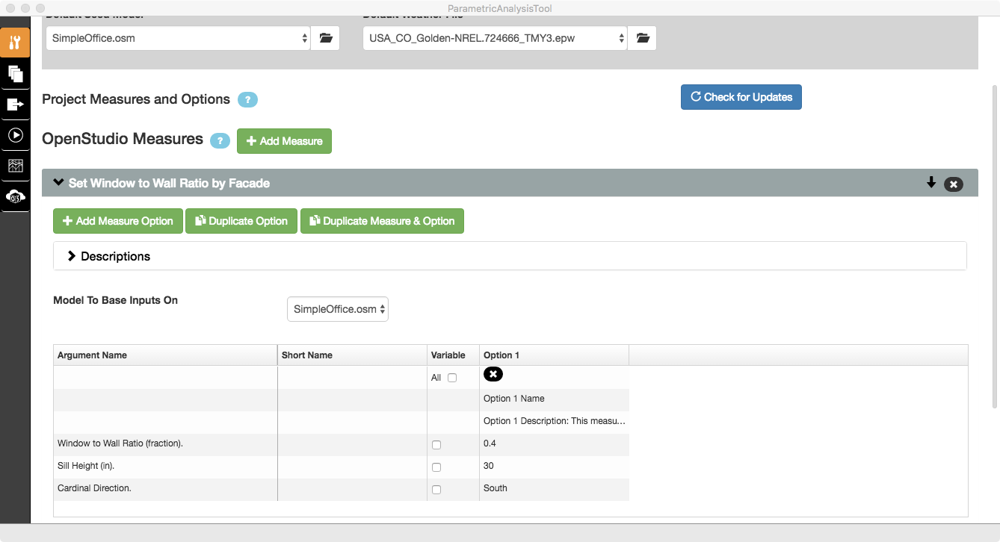
  
The variable column and associated checkboxes are used to specify which arguments will vary across design options.  Each option must be given a unique (and meaningful) name that will be referenced when constructing design alternatives.  The option description field is free-form, and can be used to capture notes regarding the option that may be used by reporting measures.  In this example, three design options have been created with variable window to wall ratios.

  

### Add the OpenStudio Results Reporting Measure to the Project

The standard OpenStudio Results measure **must** be added to every project as an option for each design alternative.  Manual project reports and most algorithmic workflows rely on outputs defined by this measure to work properly.  PAT will run without this measure and an associated measure option, but results will not appear correctly.

  
___________________

## Create Design Alternatives

The second tab is used to create design alternatives.  Buttons can be used to create and copy individual alternatives or create one alternative for each measure option in the project.  Design alternatives appear in a simple grid that allows rapid "pull down menu" selection of seed model, weather file, and measure options.  Design alternative name and description fields are free form.  It is considered a best practice to enter meaningful descriptions in these fields to document the project.

Design alternatives may be deleted using the "x" button on the left side of the screen.  Rows may be rearranged manually using the up and down arrows to the left, or sorted alphabetically by clicking the grid headings.  The order of design alternatives on this tab has no bearing on simulation order or results reporting.

_Note: Recall from the previous section that each design alternative must have an OpenStudio Results measure option.  A useful tip for accomplishing this quickly is to highlight the first option cell in the OpenStudio Results column, type the first letter of your Option (the letter O in this example), tap the down arrow, and repeat._
  
___________________

## Adding Outputs in Manual Mode

This tab is unused in manual mode, and is revisted later in this document when discussing algorithmic workflows.

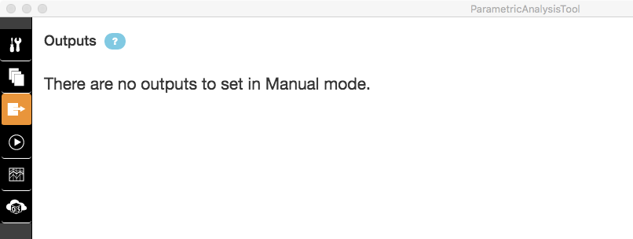

___________________

## Running an Analysis Locally

PAT 2.1.0 configures a "mini server" on your computer to perform local analysis.  This is essentially the same server that is used to run large-scale cloud analyses, enabling projects to scale and migrate between computing systems easily.  The local server begins to start up as soon as you launch PAT, and is usually ready to perform analysis within a minute.  This is indicated by a server status green checkmark at the top of the screen.

Clicking the Run Entire Workflow button starts an analysis.

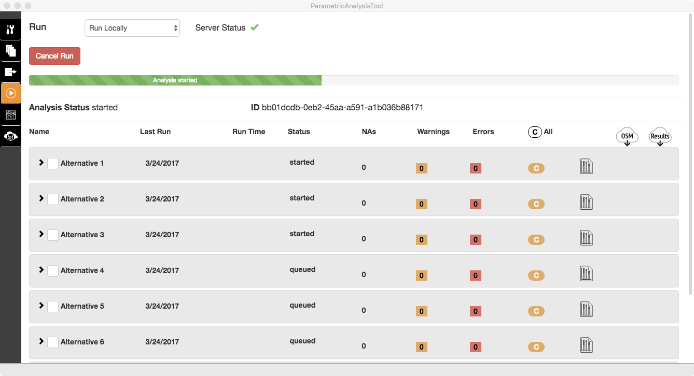
 
As simulation results are completed, PAT's status will update to appraise you of progress.  Changing tabs during active simulation is prevented to avoid accidentally altering an analysis mid-run.
 
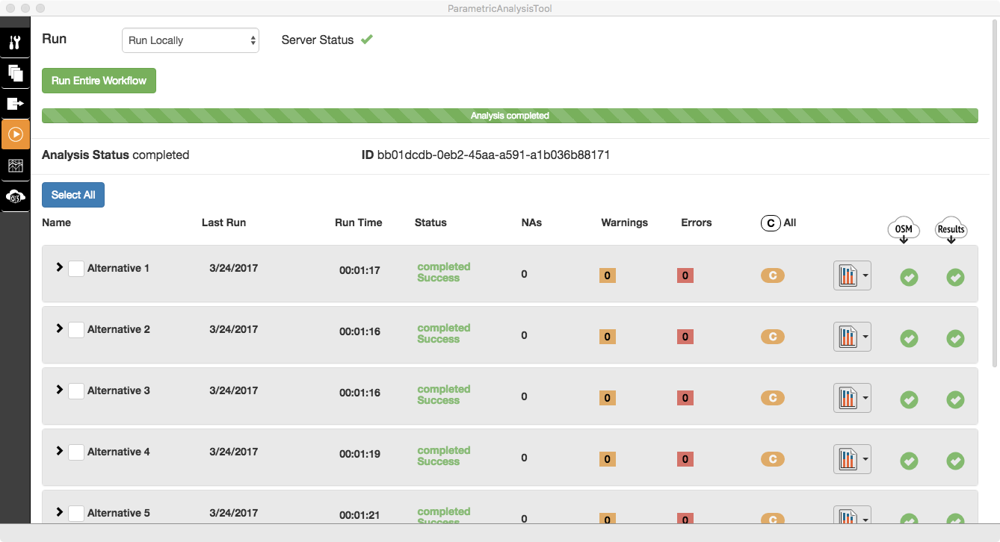
 
Completed design alternatives may be expanded to view measure or simulation log messages. The OpenStudio standard report, EnergyPlus output, results from any other reporting measure options may be viewed by clicking the graph symbol and selecting the report of interest.
 

  
___________________

## View Analysis Reports

PAT 2.1.0 includes three built-in reports that help the user compare design alternatives.

The default summary table compares consumption, demand, and economic metrics for all of the design alternatives. A selection field near the top of the table allows the user to specify which of the alternatives is to be used as the datum for performance comparison.  Analysis results shown in subsequent rows are relative to the datum's modeled values. 

  
The reports selection field at the top of the window may also be used to produce end use stacked bar charts broken down by fuel type.

  
The third default report is intended for use by modelers working with utility design assistance programs and the Energy Design Assistance Project Tracker (EDAPT). This report is used to generate data for upload to EDAPT.

  
___________________

## View OpenStudio Server

The final tab provides a view into PAT's OpenStudio server, and will not be necessary for users performing manual analyses.  It is of greater importance when performing algorithmic analysis, and will be discussed later in this document.

  

___________________

## Menu Bar Functions

The File menu allows you to create a new project, open an existing project, save a project, or save a copy of a project under a new name.  Saving a copy of a project creates a new directory structure including copies of seed models, weather files, project measures, etc.

The Windows menu allows the user to open the BCL dialog, set the location of the "MyMeasures" directory, and open up a set of server troubleshooting tools that may be helpful for advanced users.

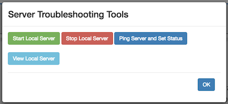
  

___________________

# Algorithmic Mode

## Setting Up an Algorithm with the Measures Tab

PAT 2.1.0 has also been designed to enable large-scale exploration of design spaces using a range of sampling, optimization, and machine learning algorithms.  Switching from "Manual" to "Algorithmic" in the Analysis selection field of tab one alters PAT's interface and functionality in a number of ways.

The first distinction is the addition of "sampling method" as a selection field near the top of tab one.  This field includes a number of methods.

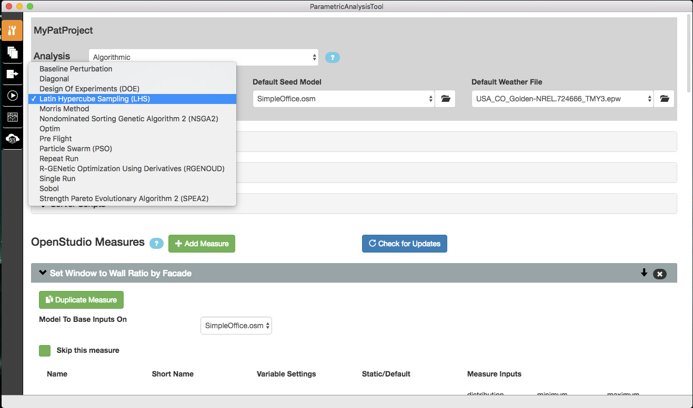

In this example, Latin Hypercube Sampling (LHS) is selected as the algorithm that will be used to guide exploration of the design space.  Immediately below the sampling method field are collapsable sections for algorithm settings, supplementary analysis files, and server scripts.  A documentation button provides guidance relevant to each algorithm and its settings.

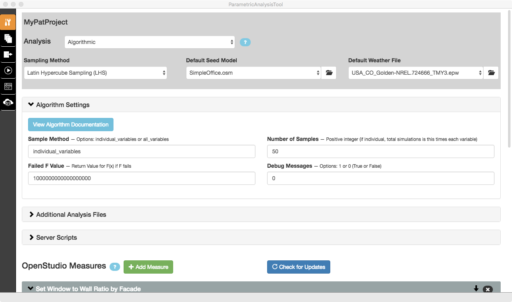

Algorithmic mode significantly alters the measure section of tab one.  The concept of manual mode's measure "option" no longer applies and variable checkboxes now become selection fields that allow the user to specify the nature of measure quantities.

1. **Argument** - Fixes the quanity as a static value for the analysis.
2. **Continuous** - Assigns a continuous probability density function to a variable.  Available distributions include uniform, triangular, normal, and log normal.
3. **Discrete** - Allows the user to specify a specific set of distinct values with associated weights.
4. **Pivot** - Forces the entire analysis to be performed against each specified value.  _e.g. An analysis problem with 25 samples and 3 pivots would create a total of 75 data points._ 

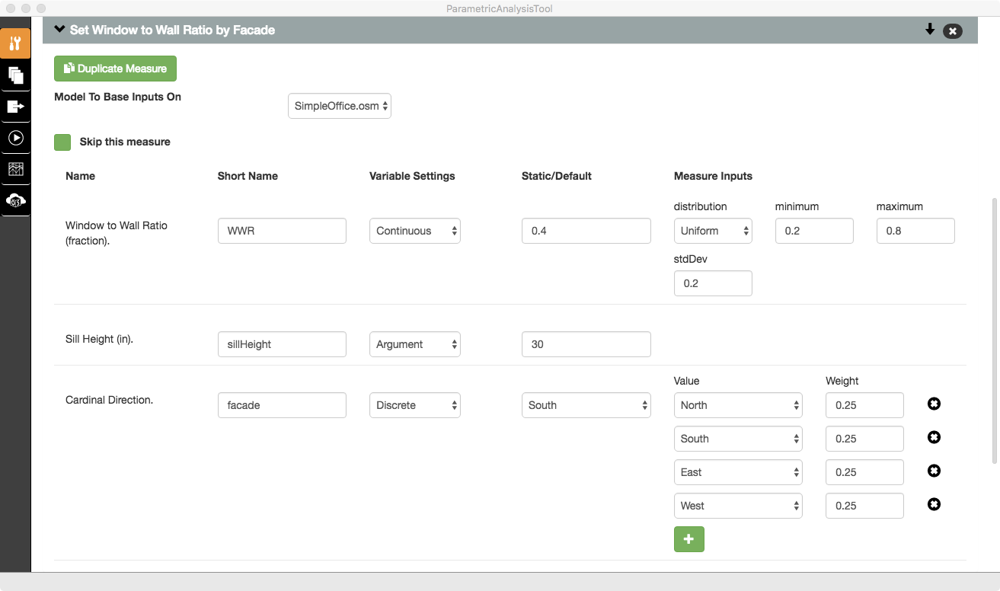

_Above: A measure contains both continuous and discrete variables._

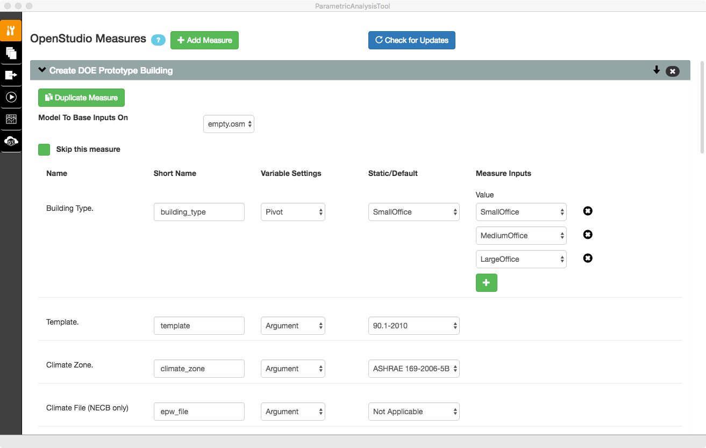

_Above: The DOE Prototype Measure is applied to an empty seed model with three pivots: SmallOffice, MediumOffice, and LargeOffice.  Subsequent measures will be applied to each of these building types, perhaps creating an office-centric technology potential analysis.  This project is available as the Office Study example [here](https://github.com/NREL/OpenStudio-PAT/tree/develop/sample_projects)._

## The Design Alternatives Tab in Algorithmic Mode

Since the algorithm is specifying the design algorithms, there is no need to use the second tab.

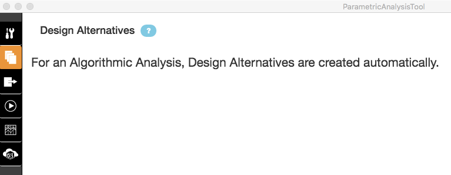

## The Outputs Tab in Algorithmic Mode

Analysis via algorithm tends to produce very large data sets.  As such, the methods for visualizing results and teasing out valuable insights differ from the simple table views available in manual mode.  In addition, some algorithms (e.g. optimizers) are goal seeking, and require specification of performance metrics to function properly.  PAT's outputs tab is designed to specify key simulation outputs for use in post-processing large sets of simulation results or in forming performance objective functions.

By default the outputs tab expects the OpenStudio Results measure to be available to provide a nominal set of outputs, although additional reporting measures can be used to add more outputs.

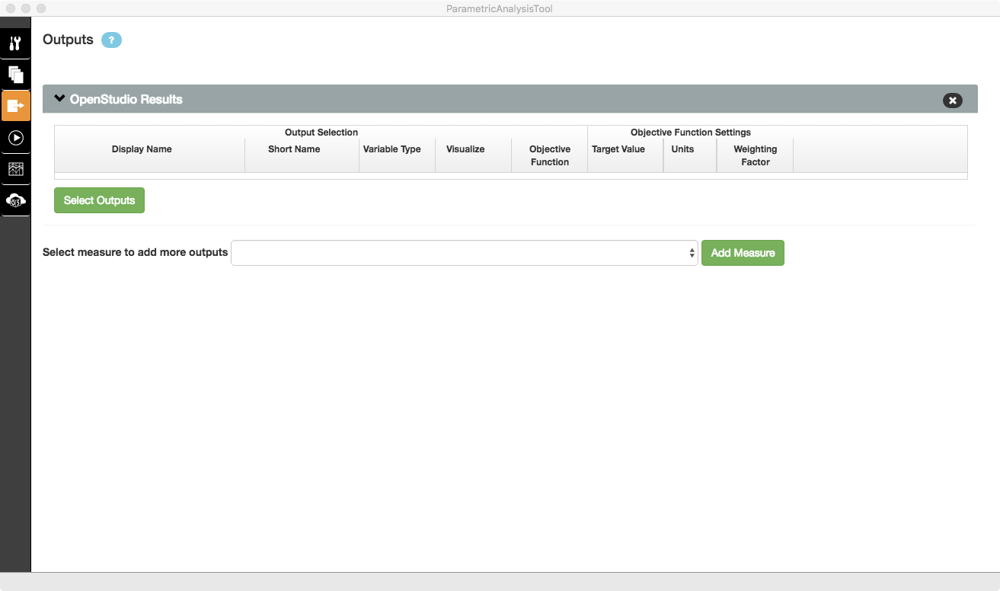

Pressing the "Select Outputs" button brings up a dialog of all measures specified by the reporting measure.  The user can choose to select all of the outputs, or individual outputs.

Selected outputs appear in the outputs tab along with additional fields.

1. **Visualize** - Should be set to true for any variables the user wishes to examine via interactive visualizations, spreadsheet, or R dataframe export.
2. **Objective Function** - Should be set to true for any variables that will be used by a goal-seeking algorithm as part of an objective function.
3. **Target Value** - The target value for the output variable that will be sought by the goal-seeking algorithm.
4. **Weighting Factor** - A multiplier used to create linear combinations of error functions in multi-objective optimization problems.

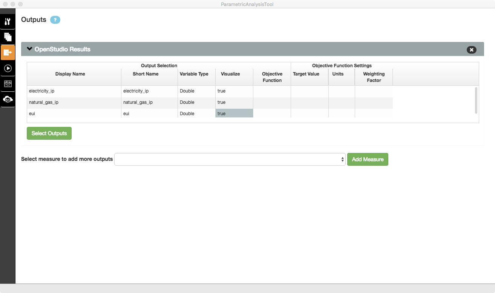

## The Run Tab in Algorithmic Mode

The size of algorithm-based analysis problems generally exceeds the computational capability of a personal computer.  PAT 2.1.0 has been designed to run these sorts of analysis in the cloud or on dedicated servers.  While PAT's "mini-server" still launches in the background, the application does not currently support simulation using local computing resources.

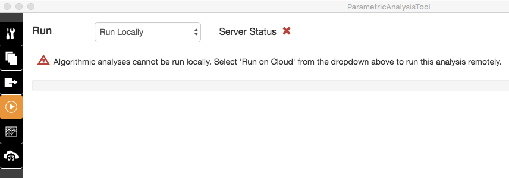

Instead, PAT expects the user to select "Run on Cloud" as the Run option.  This selection produces a dialog that enables the user to specify either an "Existing Remote Server" or Amazon Cloud.  Provisioning a dedicated server with OpenStudio Server is beyond the scope of this tutorial.  Interested users are referred to the    [OpenStudio-Server GitHub repository](https://github.com/NREL/OpenStudio-server) for further guidance on the topic.

Amazon Web Service (AWS) has been pre-provisioned with Amazon Machine Images (AMIs) for OpenStudio Server that enable users to leverage large-scale computing with minimal effort and cost.  New users will need to establish an [account](https://aws.amazon.com).  Once created, use your AWS account to generate an Access and Secret key pair.

1. In the PAT Run Tab, select "Run on Cloud" with "Amazon Cloud" as the server type.
2. Press the New Cluster button and choose a cluster name to store your AWS cluster settings.
3. Press the New AWS Credentials button and follow the prompts to enter your Access and Secret Keys.  Like the Cluster name, the AWS credential name is used by PAT to help you manage multiple cluster or credential configurations.

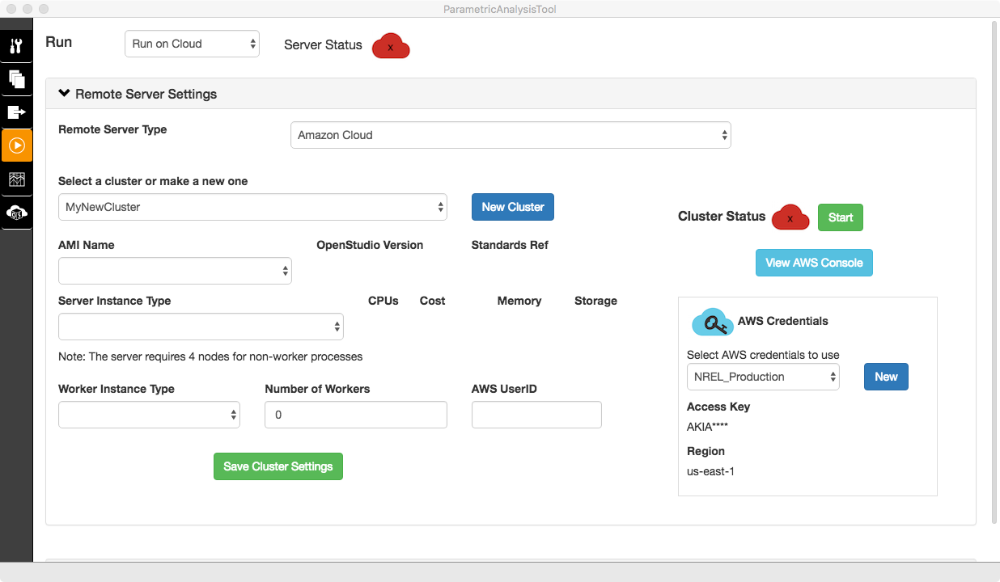

A field labeled "AMI Name" is used to specify the version of OpenStudio that the server and worker nodes will be provisioned with.  The specific version of OpenStudio and the Standards Gem are listed next to this field once selected.

The user is referred to AWS documentation related to server and worker options.  The PAT UI provides an a brief description of the compute node configuration and approximate cost/hour.  A PAT analysis requires a server and a minimum of one worker.

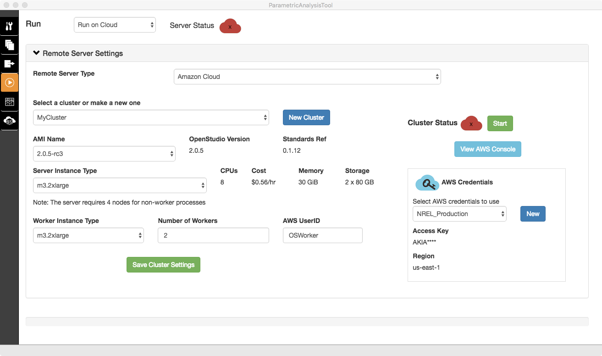

Once configured, the user should press the start button next to the Cluster Status indicator on the right side of the UI.  A dialog explaining the user's responsibility to monitor and manage AWS computing resources appears and must be acknowledge before proceeding.

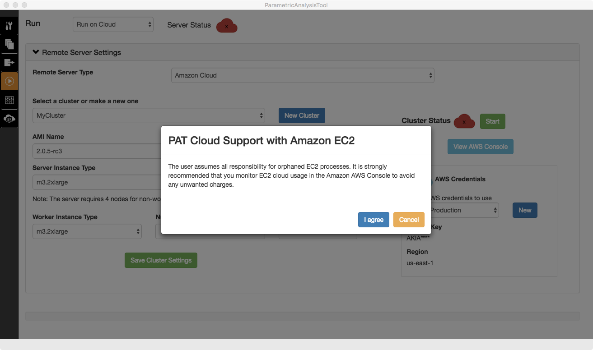

At this point, the server and worker provisioning process begins.  As the dialog states, this process can take many minutes.  Clicking on the View AWS Console button allows the user to monitor the process.

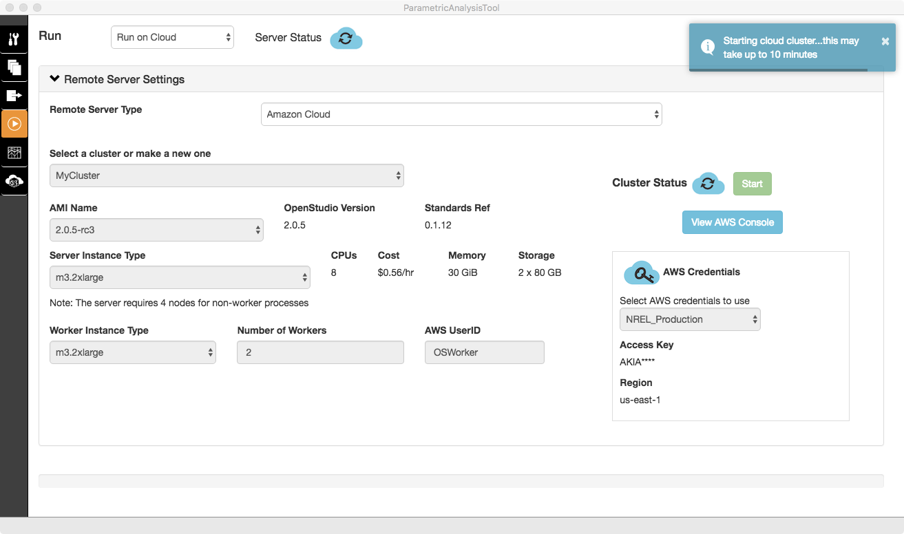

Once the server is running, clicking the "Run Entire Workflow" button starts the analysis.  Progress can be monitored within PAT or via the OpenStudio server.  One notable difference between running in manual mode with local computing resources and on the server is that detailed simulations are not automatically downloaded.  These files can be quite large.  Clicking on the blue "OSM" or "Results" cloud next to a data point will download the OpenStudio model or completed data point zip file. The cloud buttons appear as green checkmarks when a download has occurred.  Data point files are lost when the server shuts down, so it is important to download results that may be of particular interest.

## Exploring Algorithm Results with OpenStudio Server

The OpenStudio Server tab is of much greater importance with algorithmic workflows.  This same content may also be accessed through any web browser by clinking PAT's "View Server" button in the run tab or manually directing a web browser to http://**yourserverurl**:8080.  The top level view of OpenStudio server provides a summary of completed or in-progress projects and analyses along with navigation options.
 
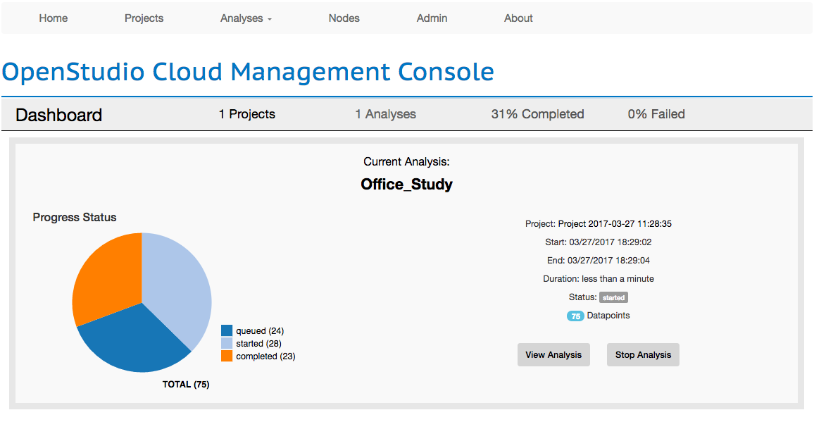

The top level of an analysis (a specific run of a project) provides a high level summary of the project, links to more detail about the analysis, and status updates for all data points that have been completed, queued for simulation, or are in process.  Important links on this page include:

1. __Project JSON__ - The JSON link near the top left of this screen is the OpenStudio Analysis (OSA) JSON that PAT produces for the Server.  It is a complete definition of the analysis to be performed including SEED models, weather files, measures, arguments & variables, outputs, algorithms, etc.
2. __Project Log__ - Immediately next to the Project JSON is a log file, which can be helpful in debugging failed analyses.
3. __Downloads__ - These links download high level meta data and simulation results as CSV or R Data Frames for subsequent analysis.  These results include only analysis inputs and outputs that have been defined in PAT.  Detailed simulation results associated with individual data points must be downloaded in PAT or via individual data point web links.
4. __Data points__ - The bottom of the analysis page includes a snapshot of all data points along with their status, run times, and data point-specific links including the data point JSON file (OSW) and the data point zip file.
5. __Data and Visualizations__ - A number of useful project summaries and interactive visualization tools are built into OpenStudio server.  One of these, the parallel coordinate plot, is described in further detail below.

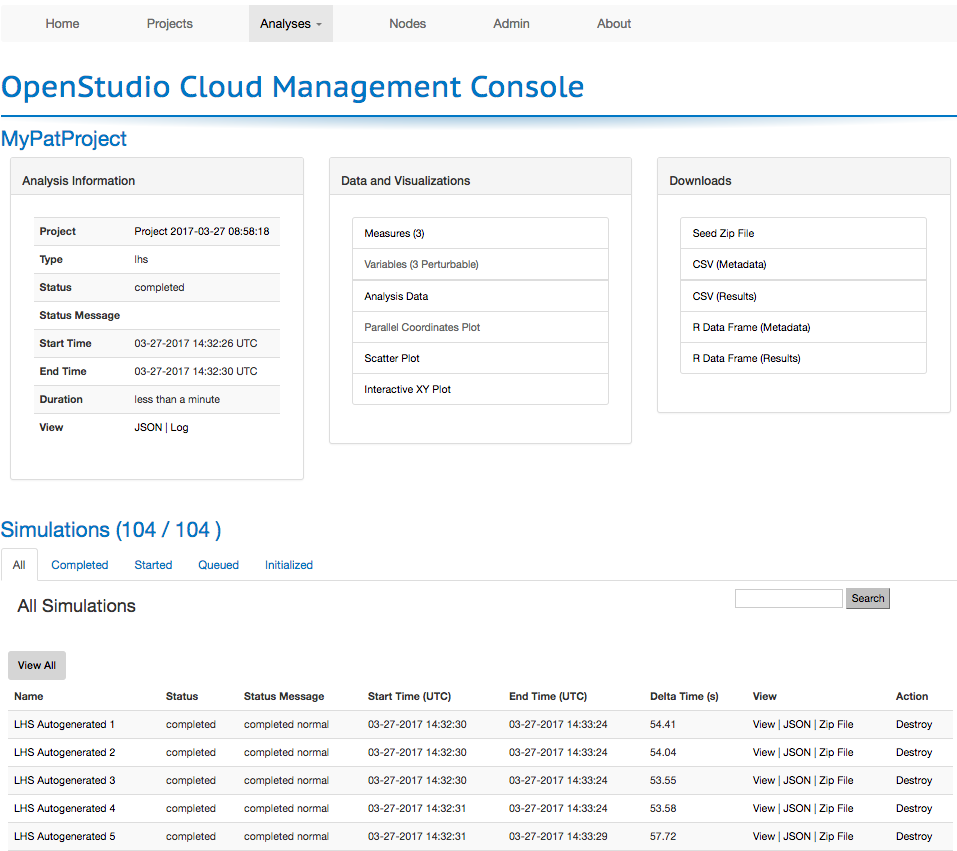

The variables link near the top center of the analysis web page provides a concise summary of variables and arguments utilized by the analysis' algorithm.  While any applicable measures are summarized in an adjacent page, this section provides more detail about how data points have been generated.  In the example below, three building types form the core of the analysis.  A five level "Design of Experiments" with lighting power density reduction percentage and window to wall ratio variables complete the study space.  Other sampling methods (e.g. LHS) include thumbail graphics illustrating variable distributions.

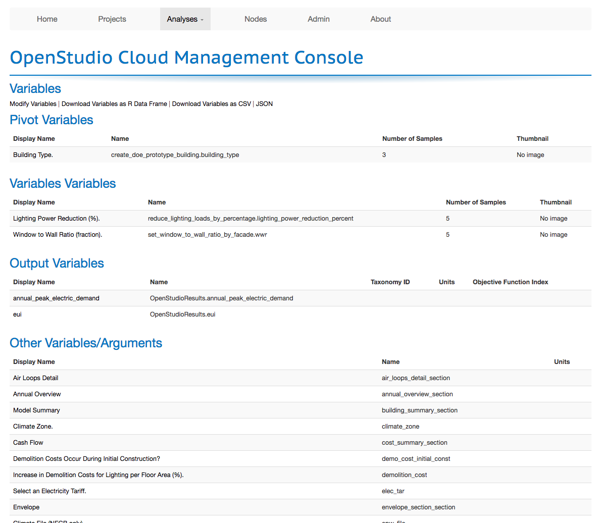

Parallel coordinate plots provide an interactive means of exploring large data sets and teasing out valuable insights.  OpenStudio enables the user to select inputs and outputs that have been pre-defined in PAT's measures and outputs tabs.  Checkboxes turn inputs on and off, and the individual plot axes can be re-ordered via drag and drop.  In this first example, LHS is used to sample the parameter space for lighting power density, window to wall ratio, and the facade on which windows are placed.  Energy Use Intensity (EUI) is selected as the output of interest.

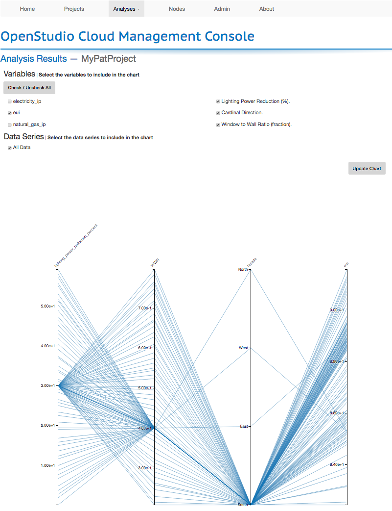

## Example Projects

Several sample PAT projects may be found [here](https://github.com/NREL/OpenStudio-PAT/tree/develop/sample_projects).  Both the Office_Hvac and Office_Study projects are configured to run in manual model using local computing resources.  The remaining "SEB" projects pertain to NREL's Site Entrance Building (SEB), and demonstrate the various algorithms available for use in the cloud.  Several of the SEB projects are also notable as examples of performing sampling or optimization-based calibrations of a model using Actual Meteorlogic Year (AMY) and consumption data.
The "AddMonthlyJSONUtilityData" measure is used to add electric and gas consumption data to the model.  The "CalibrationReportsEnhanced20" reporting measure is used to create analysis outputs and charts that describe the calibration's "goodness of fit."

### A Model Calibration Example

As a closing example, consider the SEB "PSO_2013" project.  This project utilizes the particle swarm algorithm to explore variations of the SEB seed model.  OpenStudio Server's parallel coordinate plot is a convenient means of interacting with the large number of solutions generated during the analysis.  Input or output coordinate ranges may be selected using the mouse to filter out solutions of interest - in this case, data points with low Coefficient of Variation of the Root Mean Squared Error (CVRMSE) and Net Mean Bias Error (NMBE) for both gas and electricity consumption.  Data points which fall within the filtered ranges (indicated in blue) are provided as links below the plot.

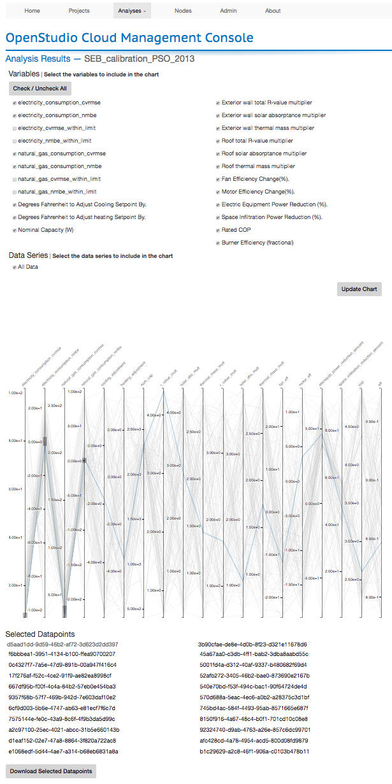

Clicking on one of these data points allows us to see the specific measure variable values that define the data point.  This page also allows convenient download of the specific OpenStudio Workflow (OSW) that generate the point, the resulting model, simulation results, and associated reports.

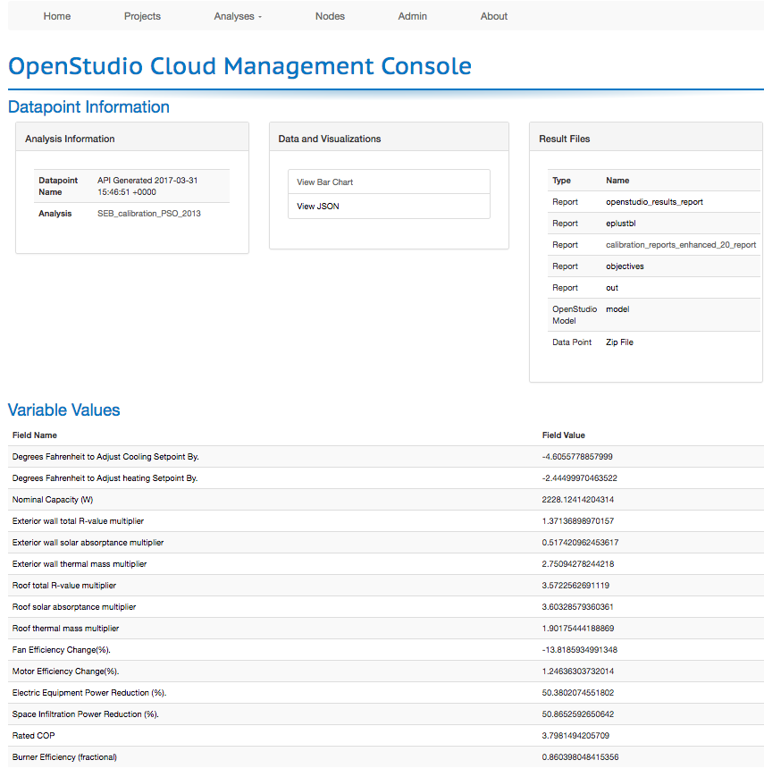

Output from the Enhanced Calibration Report for this data point is one of the available report links, and allows us to quickly visualize the performance of this particular model variant relative to the building's original measured consumption data.

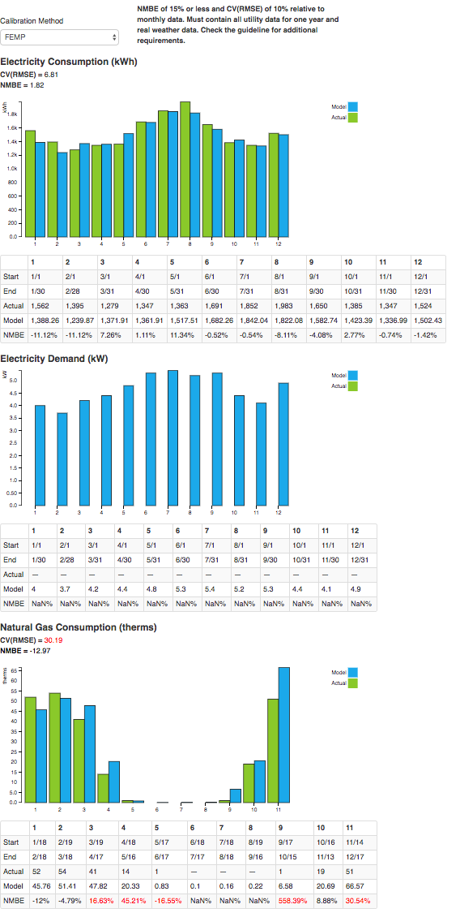